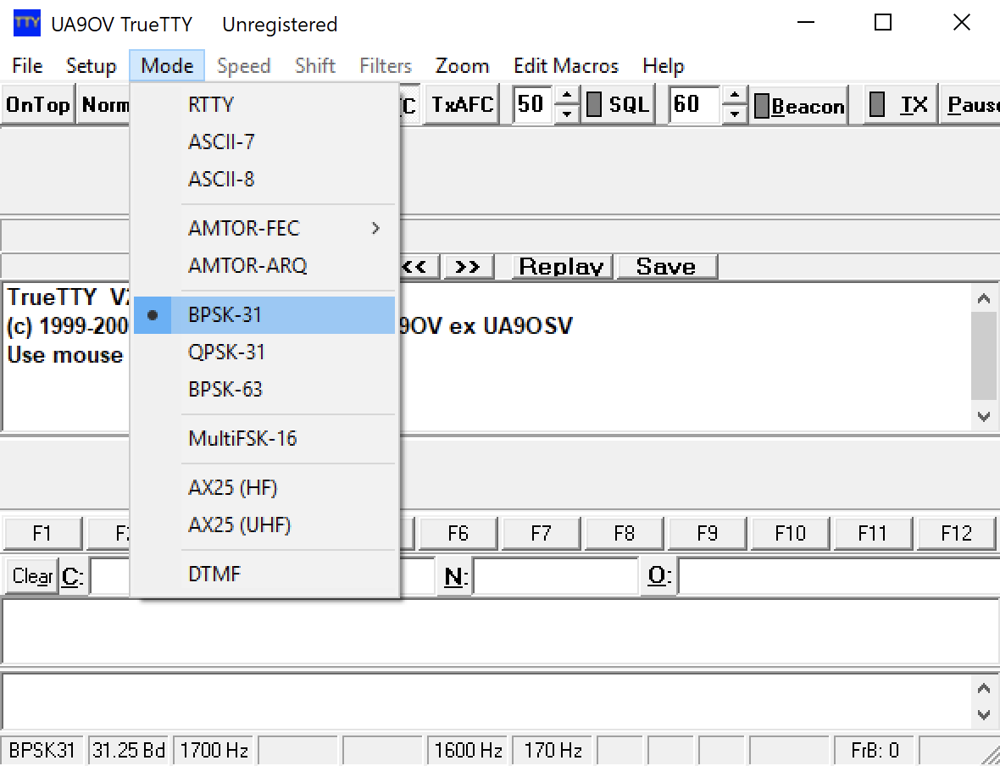
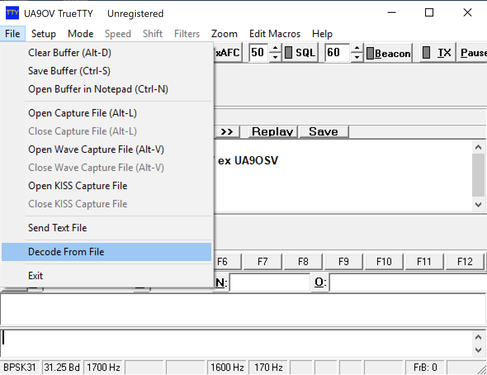
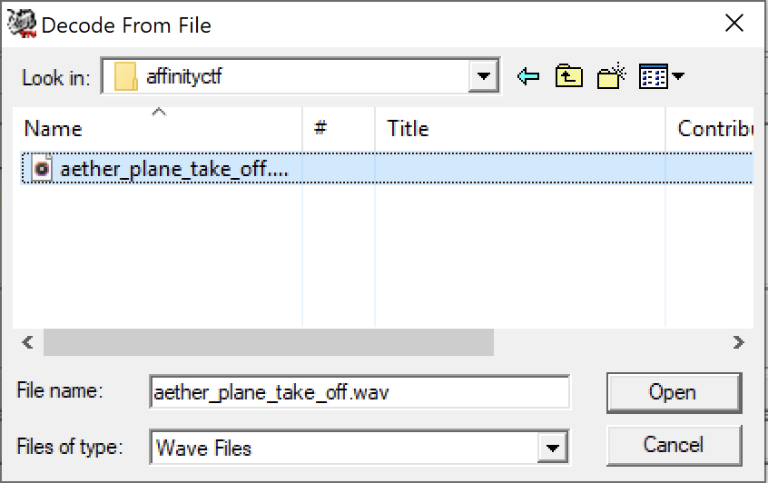
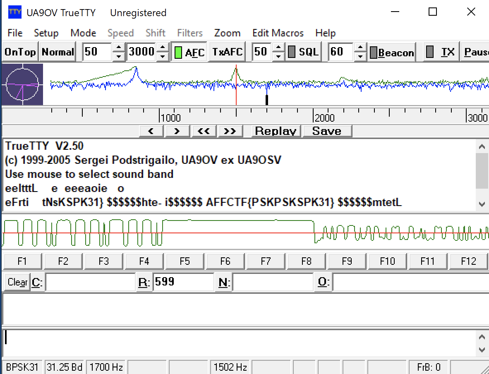

#  Aether plane take off writeup

1. Google the description to figure out what this actually is.

2. Search for similar ctf challenges, and find writeups.

3. Download and install TrueTTY software, found here: https://www.dxsoft.com/en/products/truetty/
4. Start the program, change mode to BPSK-31 by going to Mode -> BPSK-31 as shown on the screenshot:

5. Go to File -> Decode from file and browse to the .wav file as shown on the screenshots:

6. Read the flag presented in the programs output as shown on the screenshot:

If necessary, repeat the step 3 and 4, as the program might not recognise the flag on the first run.
