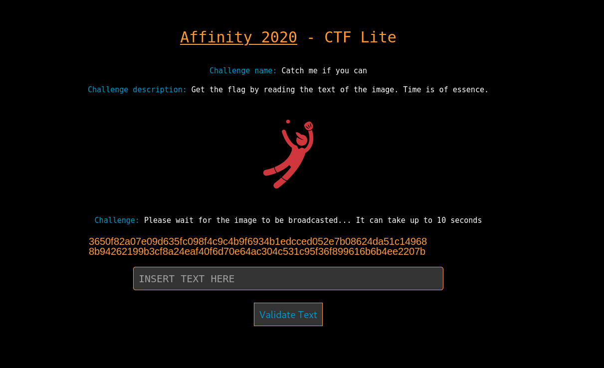
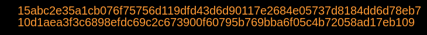

# Catch me if you can! 


## The Challenge

We are given the following website:



The description tells us what to do, namely get the text given in orange and
validate it in the form. 
It is not possible to just copy paste it as it is an image. It is nor possible
to just write it down as it changes within a few seconds, and explains why the desccription says "Time is of the essence".


## Solution

We solved it using an OCR library for Python. We found a [towards data science](https://towardsdatascience.com/read-text-from-image-with-one-line-of-python-code-c22ede074cac)
article using [pytesseract](https://github.com/madmaze/pytesseract) which we ended up using. 
We installed it along with [Tesseract](https://github.com/tesseract-ocr/tesseract) 


### Initial Try

First we thought we had enough time to just quickly take a screenshot of the orange text, save it and run the program.

```python
from PIL import Image
import pytesseract

text = pytesseract.image_to_string(Image.open('images/img.png'))

# Remove the newline from the text
chars = [x for x in text if "\n" not in x]

print(''.join(chars))

```

This somtimes gave the correct result, at times the `pytesseract` did
not give the correct result (characters not recognised correctly), but then we just tried again until we found a text that was recognised.

After a few tries trying to paste it into the form we gave up, and needed to make it faster as the 
validation took a bit of time.

### Second try

We needed to automate the process of taking the image, we found 
a [stackoverflow](https://stackoverflow.com/a/41384253) answer that
showed how to do it with `ImageGrab`

We modified it to our usecase and also found out how to use `bbox=(x,y,x+n,y+z)` to only get the correct part of the image (the text).

This was a bit of trial end error, but after a while we the params `bbox=(850, 650, 1580, 710)`. 

The screenshot taken looked like: 



The final script looked like: 
```python
from PIL import Image, ImageGrab
import pytesseract

snapshot = ImageGrab.grab(bbox=(850, 650, 1580, 710))
save_path = "images/img.png"  
snapshot.save(save_path)

text = pytesseract.image_to_string(Image.open('images/img.png'))

# Remove the newline from the text
chars = [x for x in text if "\n" not in x]

print(''.join(chars))
```

Running the script we got the following text:

`15abc2e35a1cb076f75756d119dfd43d6d90117e2684e05737d8184dd6d78eb710d1aea3f3c6898efdc69c2c673900f60795b769bba6f05c4b72058ad17eb109`

We timed the script to run right after a new text was rendered on the screen, then quickly copy pasted the result into the form and validated it. 

This was a *hacky* solution as we just copy pasted it. We could have 
written a Python script to post it to the website as well, but it was enough to get the flag.

`AFFCTF{Y0uC4ughtM38ySupr1s3!}`