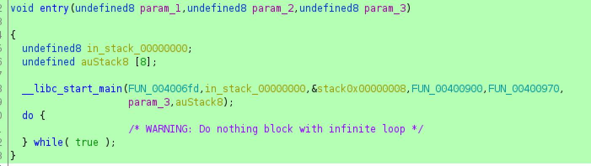
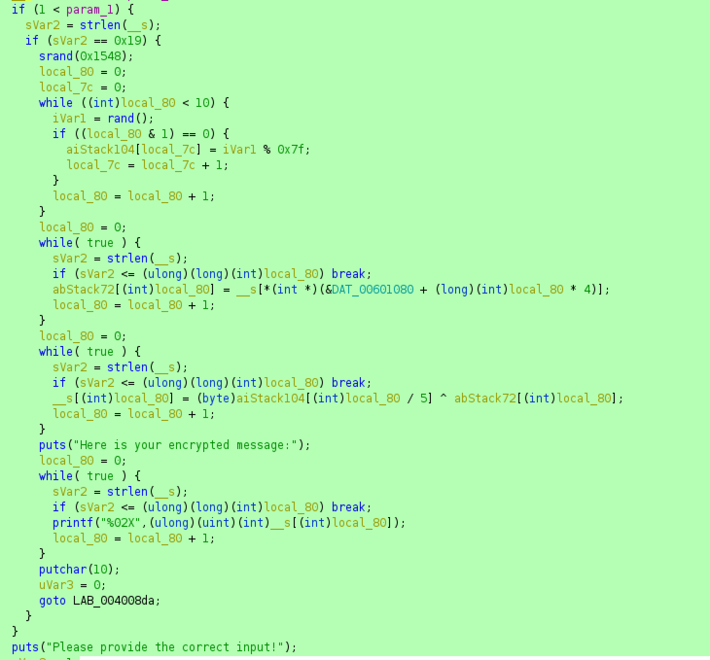

# psudo-psudo random


The is a 64bit ELF binary is stripped of debugging symbols. The easiest way to find the main method, is to open tile file in Ghidra, go to the entry function. The first parameter to `__libc_start_man` is always (if not obfuscated) the main function.



We can see that the program expects one arguments, and that this argument should be a string of length 25. 

Looking further in the main function we can see that it first creates a list of 5 random numbers < 0x80. These numbers will always be the same as srand() is initialized with a static value.

It then shuffles the numbers based on indexes located in `DAT_00601080`. In the end it xors every character with one of the 5 numbers obtained from the random function.



I used gdb to extract the random numbers generated. I could also have created these myself using the same seed. 

I then copied the shuffle array from ghidra, and copied the original output of the program from message into a python script, in which i reversed the process:

```python
xors = [0xe, 0x4a, 0x79, 0x5, 0x66]

idxs = [23, 14, 2, 21, 11, 3, 4, 16, 22, 5, 18, 6, 12, 7, 19, 1, 8, 20, 9, 10, 13, 24, 0, 17, 15]
encoded = [0x63, 0x51, 0x48, 0x6A, 0x40, 0x09, 0x1E, 0x7A, 0x7A, 0x0C, 0x0B, 0x02, 0x49, 0x48, 0x4D, 0x43, 0x71, 0x6B, 0x30, 0x5A, 0x12, 0x1B, 0x27, 0x39, 0x53]

plain = [0] * 25
for i in range(25):
    plain[idxs[i]]= encoded[i] ^ xors[i // 5]


flag = ''.join([chr(x) for x in plain])
print(flag)
```

`flag: AFFCTF{1t5_N0t_50_r4nd0m}`